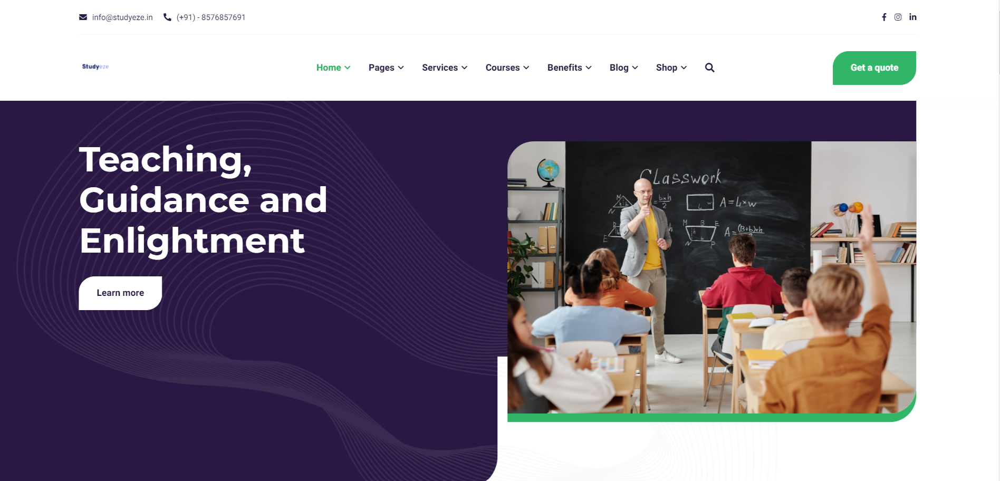

# Studyeze 
## Teaching, Guidance & Enlightment

## Introduction
- In a world where learning only comes from our formative years in school and college, Studyeze is the new, easy, and definitive path for keeping up with the 21st century. It is the platform where you can finally stop trying to fit in a system crafted for the masses and learn in a unique way that brings out the best version of you.

## Description
- Our mentors are the essence of bringing about the revolution needed to make learning fun, meaningful and outcome-based.

- Courses at Studyeze are self-paced. Take 2 weeks or 3 months – at Studyeze, you are allowed to learn at your own pace and every course is designed to cater to your personal needs, which means you pay once and learn life-long.

## Services
- Studyeze has a huge E-library containing notes, assignments & Question Papers. It starts providing free cerfication courses by the best experts of studyeze. It allows you to publish your own article on studyeze website. Studyeze Presents it's first Android Application which will be Launching soon. Application will be Available on Google Play Store or Amazon Appstore.

